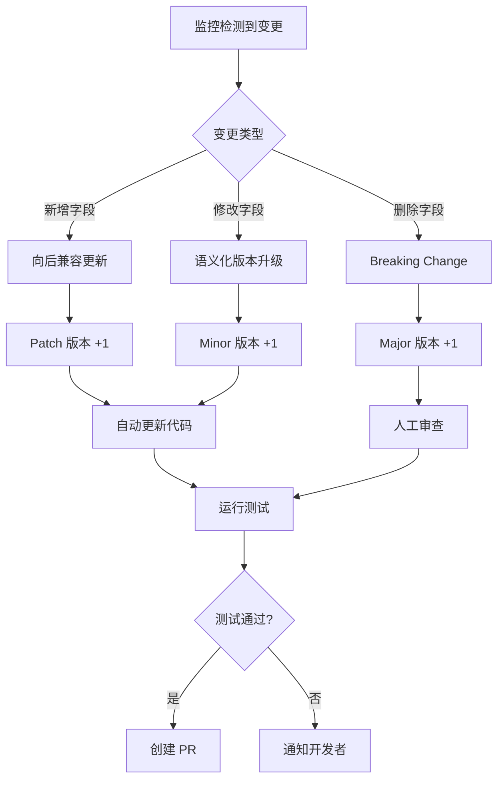

# Amazon Ads API Go SDK 架构设计

> **版本**: v0.1.0 (设计阶段)  
> **最后更新**: 2025-10-07  
> **参考**: Amazon SP-API Go SDK v1.3.0

---

## 📋 目录

1. [设计原则](#设计原则)
2. [项目结构](#项目结构)
3. [核心组件](#核心组件)
4. [API 版本管理](#api-版本管理)
5. [官方监控机制](#官方监控机制)
6. [代码生成策略](#代码生成策略)
7. [与 SP-API SDK 的关系](#与-sp-api-sdk-的关系)
8. [开发路线图](#开发路线图)

---

## 🎯 设计原则

### 1. **独立性原则**
- **独立仓库**: `amazon-ads-api-go-sdk`（独立于 SP-API SDK）
- **独立版本**: 独立的语义化版本控制（v1.0.0+）
- **独立文档**: 完整的 README、API 文档、示例代码

### 2. **一致性原则**
- **架构一致**: 与 SP-API SDK 保持相同的架构模式
- **代码风格一致**: 使用相同的 Google 风格注释、中文注释
- **测试规范一致**: 相同的测试覆盖率要求（90%+）

### 3. **可复用原则**
- **共享基础设施**: 通过 Go Modules 引用 SP-API SDK 的基础组件
- **避免重复**: 不重复实现认证、签名、限流等通用功能
- **模块化设计**: 每个 API 独立包，降低耦合

### 4. **可扩展原则**
- **版本隔离**: 支持多个 API 版本并存
- **向后兼容**: 新版本不破坏旧版本的 API
- **OpenAPI 优先**: 优先使用官方 OpenAPI 规范自动生成

---

## 📁 项目结构

```
amazon-ads-api-go-sdk/
├── .github/                           # GitHub 配置
│   ├── workflows/
│   │   ├── tests.yml                  # CI/CD 测试流程
│   │   ├── api-monitor.yml            # API 官方监控
│   │   └── release.yml                # 自动发布流程
│   ├── ISSUE_TEMPLATE/
│   │   ├── bug_report.md
│   │   ├── feature_request.md
│   │   └── commercial_license.md
│   └── PULL_REQUEST_TEMPLATE.md
│
├── cmd/                               # 命令行工具
│   ├── api-monitor/                   # API 规范监控工具
│   │   ├── main.go
│   │   ├── api-list.json              # 监控的 API 列表
│   │   ├── api-state.json             # API 状态存储
│   │   └── README.md
│   └── generator/                     # 代码生成器
│       ├── main.go
│       └── README.md
│
├── pkg/                               # 公共 API（外部可导入）
│   └── adsapi/                        # Amazon Ads API 客户端
│       ├── client.go                  # 主客户端
│       ├── config.go                  # 配置管理
│       ├── errors.go                  # 错误定义
│       ├── types.go                   # 公共类型
│       │
│       ├── profiles-v3/               # Profiles API v3
│       │   ├── client.go              # API 客户端（swagger-codegen 生成）
│       │   ├── configuration.go       # 配置（swagger-codegen 生成）
│       │   ├── model_*.go             # 数据模型（swagger-codegen 生成）
│       │   ├── api_*.go               # API 服务（swagger-codegen 生成）
│       │   ├── model_object.go        # 手动添加（修复 bug）
│       │   └── doc.go                 # 手动添加（包文档）
│       │
│       ├── portfolios-v2/             # Portfolios API v2
│       │   ├── client.go              # API 客户端（swagger-codegen 生成）
│       │   ├── configuration.go       # 配置（swagger-codegen 生成）
│       │   ├── api_*.go               # API 服务（swagger-codegen 生成）
│       │   ├── model_*.go             # 数据模型（swagger-codegen 生成）
│       │   ├── model_object.go        # 手动添加（修复 bug）
│       │   └── doc.go                 # 手动添加（包文档）
│       │
│       ├── sponsored-products-v3/     # Sponsored Products API v3
│       │   ├── client.go              # APIClient（手动补充）
│       │   ├── configuration.go       # 配置（swagger-codegen 生成）
│       │   ├── api_campaigns.go       # Campaigns API（swagger-codegen 生成）
│       │   ├── api_ad_groups.go       # Ad Groups API（swagger-codegen 生成）
│       │   ├── api_keywords.go        # Keywords API（swagger-codegen 生成）
│       │   ├── api_*.go               # 其他 API 服务（共 24 个）
│       │   ├── model_*.go             # 数据模型（swagger-codegen 生成）
│       │   ├── model_object.go        # 手动添加（修复 bug）
│       │   ├── doc.go                 # 手动添加（包文档）
│       │   └── client_test.go         # 手动添加（单元测试）
│       │
│       ├── sponsored-brands-v4/       # Sponsored Brands API v4
│       │   ├── client.go              # API 客户端（swagger-codegen 生成）
│       │   ├── configuration.go       # 配置（swagger-codegen 生成）
│       │   ├── api_*.go               # API 服务（swagger-codegen 生成）
│       │   ├── model_*.go             # 数据模型（swagger-codegen 生成）
│       │   ├── model_object.go        # 手动添加（修复 bug）
│       │   └── doc.go                 # 手动添加（包文档）
│       │
│       ├── sponsored-display-v3/      # Sponsored Display API v3
│       │   ├── client.go              # API 客户端（swagger-codegen 生成）
│       │   ├── configuration.go       # 配置（swagger-codegen 生成）
│       │   ├── api_*.go               # API 服务（swagger-codegen 生成）
│       │   ├── model_*.go             # 数据模型（swagger-codegen 生成）
│       │   ├── model_object.go        # 手动添加（修复 bug）
│       │   └── doc.go                 # 手动添加（包文档）
│       │
│       └── reporting-v3/              # Reporting API v3
│           ├── client.go              # API 客户端（swagger-codegen 生成）
│           ├── configuration.go       # 配置（swagger-codegen 生成）
│           ├── api_reports.go         # Reports API（swagger-codegen 生成）
│           ├── model_*.go             # 数据模型（swagger-codegen 生成）
│           ├── model_object.go        # 手动添加（修复 bug）
│           └── doc.go                 # 手动添加（包文档）
│
├── internal/                          # 内部实现（外部不可导入）
│   ├── auth/                          # 认证模块（继承自 SP-API）
│   │   ├── lwa.go                     # LWA OAuth 2.0
│   │   ├── token_cache.go             # Token 缓存
│   │   └── auth_test.go
│   │
│   ├── transport/                     # HTTP 传输（继承自 SP-API）
│   │   ├── client.go                  # HTTP 客户端
│   │   ├── retry.go                   # 重试逻辑
│   │   ├── circuit_breaker.go         # 熔断器
│   │   └── transport_test.go
│   │
│   ├── ratelimit/                     # 速率限制（ADS-API 特定）
│   │   ├── manager.go                 # 限流管理器
│   │   ├── token_bucket.go            # 令牌桶算法
│   │   └── ratelimit_test.go
│   │
│   ├── metrics/                       # Prometheus 指标收集
│   │   ├── prometheus.go
│   │   └── prometheus_test.go
│   │
│   ├── models/                        # 通用数据模型
│   │   ├── region.go
│   │   └── region_test.go
│   │
│   └── utils/                         # 工具函数
│       ├── json.go                    # JSON 处理
│       ├── url.go                     # URL 构建
│       └── utils_test.go
│
├── examples/                          # 示例代码
│   ├── basic_usage/
│   │   └── main.go                    # 基础使用示例
│   ├── advanced_usage/
│   │   └── main.go                    # 高级功能示例
│   ├── campaign_management/
│   │   └── main.go                    # 广告活动管理
│   ├── reporting/
│   │   └── main.go                    # 报告生成和下载
│   └── README.md
│
├── tests/                             # 集成测试
│   ├── integration/
│   │   ├── profiles_test.go
│   │   ├── campaigns_test.go
│   │   └── reporting_test.go
│   └── benchmarks/
│       └── benchmark_test.go
│
├── docs/                              # 文档
│   ├── ARCHITECTURE.md                # 架构设计（本文档）
│   ├── API_COVERAGE.md                # API 覆盖范围
│   ├── DEVELOPMENT.md                 # 开发指南
│   ├── RATE_LIMITS.md                 # 速率限制说明
│   ├── AUTHENTICATION.md              # 认证指南
│   ├── VERSION_TRACKING.md            # 版本追踪
│   └── modules/                       # 模块文档
│       ├── profiles.md
│       ├── portfolios.md
│       ├── sponsored-products.md
│       ├── sponsored-brands.md
│       ├── sponsored-display.md
│       └── reporting.md
│
├── scripts/                           # 脚本工具
│   ├── generate-apis.ps1              # 生成 API 客户端
│   ├── update-docs.ps1                # 更新文档
│   └── test.sh                        # 测试脚本
│
├── .gitignore
├── .golangci.yml                      # Lint 配置
├── go.mod                             # Go Modules
├── go.sum
├── LICENSE                            # AGPL-3.0 + Commercial
├── README.md                          # 项目说明
├── DEVELOPMENT.md                     # 开发规范
├── CHANGELOG.md                       # 变更日志
└── CONTRIBUTING.md                    # 贡献指南
```

---

## 🔧 核心组件

### 1. **主客户端** (`pkg/adsapi/client.go`)

```go
package adsapi

import (
    "github.com/vanling1111/amazon-sp-api-go-sdk/internal/auth"
    "github.com/vanling1111/amazon-sp-api-go-sdk/internal/transport"
    "github.com/vanling1111/amazon-ads-api-go-sdk/internal/ratelimit"
)

// Client 是 Amazon Ads API 的主客户端
type Client struct {
    config           *Config
    lwaClient        *auth.Client          // 复用 SP-API 的认证
    httpClient       *transport.Client     // 复用 SP-API 的 HTTP 客户端
    rateLimitManager *ratelimit.Manager    // ADS-API 特定的速率限制
}

// NewClient 创建新的 Ads API 客户端
func NewClient(cfg *Config) (*Client, error) {
    // ...
}
```

**关键特性**:
- ✅ 复用 SP-API SDK 的 `internal/auth` 和 `internal/transport`
- ✅ 实现 ADS-API 特定的速率限制逻辑
- ✅ 统一的错误处理和重试机制

### 2. **配置管理** (`pkg/adsapi/config.go`)

```go
type Config struct {
    // LWA 认证配置
    ClientID     string
    ClientSecret string
    RefreshToken string

    // Ads API 配置
    ProfileID    int64    // Advertising Profile ID
    Region       Region   // NA, EU, FE
    Sandbox      bool     // 沙箱模式

    // HTTP 配置
    Timeout      time.Duration
    MaxRetries   int
    EnableMetrics bool
}
```

### 3. **API 客户端** (独立包)

每个 API 版本独立成包：

```go
// pkg/adsapi/sponsored-products-v3/client.go
package sponsored_products_v3

import "github.com/vanling1111/amazon-ads-api-go-sdk/pkg/adsapi"

// Client 是 Sponsored Products API v3 客户端
type Client struct {
    baseClient *adsapi.Client
}

// NewClient 创建 Sponsored Products API v3 客户端
func NewClient(baseClient *adsapi.Client) *Client {
    return &Client{baseClient: baseClient}
}

// ListCampaigns 列出所有广告活动
func (c *Client) ListCampaigns(ctx context.Context, opts *ListCampaignsOptions) (*CampaignList, error) {
    // ...
}
```

---

## 📦 API 版本管理

### 版本命名规范

遵循 Amazon Ads API 官方版本号：

| API 分类              | 包名                          | 官方版本     |
|-----------------------|-------------------------------|--------------|
| Profiles              | `profiles-v2`                 | v2           |
| Portfolios            | `portfolios-v4`               | v4           |
| Sponsored Products    | `sponsored-products-v3`       | v3           |
| Sponsored Brands      | `sponsored-brands-v4`         | v4           |
| Sponsored Display     | `sponsored-display-v3`        | v3           |
| Reporting             | `reporting-v3`                | v3           |

### 多版本并存策略

```go
import (
    sp_v3 "github.com/vanling1111/amazon-ads-api-go-sdk/pkg/adsapi/sponsored-products-v3"
    sb_v4 "github.com/vanling1111/amazon-ads-api-go-sdk/pkg/adsapi/sponsored-brands-v4"
)

// 同时使用不同版本的 API
spClient := sp_v3.NewClient(baseClient)
sbClient := sb_v4.NewClient(baseClient)
```

### 版本升级迁移

当官方发布新版本 API 时：

1. **保留旧版本**: `sponsored-products-v3` 继续可用
2. **新增新版本**: `sponsored-products-v4` 作为新包
3. **标记废弃**: 在旧版本文档中标记 `Deprecated`
4. **迁移指南**: 提供 `docs/migration/v3-to-v4.md`

---

## 🔍 官方监控机制

### 设计目标

自动监控 Amazon Ads API 官方文档和规范变更，确保 SDK 与官方保持同步。

### 监控架构

```
┌─────────────────────────────────────────────────────────────┐
│                    GitHub Actions (每日)                    │
└──────────────────┬──────────────────────────────────────────┘
                   │
                   ▼
┌─────────────────────────────────────────────────────────────┐
│              cmd/api-monitor/main.go                        │
│                                                             │
│  1. 拉取官方 API 文档/规范                                  │
│  2. 计算 SHA256 哈希值                                      │
│  3. 与上次哈希对比                                          │
│  4. 检测到变更 → 创建 GitHub Issue                          │
└──────────────────┬──────────────────────────────────────────┘
                   │
                   ▼
┌─────────────────────────────────────────────────────────────┐
│              api-state.json (状态存储)                      │
│                                                             │
│  [                                                          │
│    {                                                        │
│      "api": "sponsored-products-v3",                        │
│      "hash": "a3f2e1...",                                   │
│      "last_check": "2025-10-07T00:00:00Z"                   │
│    }                                                        │
│  ]                                                          │
└─────────────────────────────────────────────────────────────┘
```

### 监控数据源

**优先级 1: OpenAPI 规范**（如果官方提供）
```
https://advertising-api.amazon.com/openapi/sponsored-products-v3.json
```

**优先级 2: 官方文档变更**
```
https://advertising.amazon.com/API/docs/
```

**优先级 3: GitHub 仓库**（如果有）
```
https://github.com/amzn/amazon-advertising-api-models
```

### 监控频率

- **定时检查**: 每天 00:00 UTC
- **手动触发**: 通过 GitHub Actions `workflow_dispatch`
- **PR 检查**: 每次 PR 时验证 API 版本一致性

### 变更处理流程



---

## ⚙️ 代码生成策略

### 单层架构：直接使用 Swagger-Codegen 生成

基于以下考虑，我们采用**单层架构**（直接暴露生成的代码）：

#### 代码生成工具：Swagger-Codegen

**工具选择**: `swagger-codegen-cli-3.0.62.jar`

**为什么选择 swagger-codegen**:
- ✅ Amazon 官方 SP-API SDK 使用的工具
- ✅ 生成的代码质量高，可直接使用
- ✅ 支持完整的客户端（Client + Configuration + API Services）
- ✅ 能处理 Amazon OpenAPI 规范中的特殊格式（如 `type: number, format: int64`）

```bash
# 生成 API 客户端代码
java -jar swagger-codegen-cli-3.0.62.jar generate \
  -i specs/sponsored-products-v3.json \
  -l go \
  -o pkg/adsapi/sponsored-products-v3 \
  --additional-properties packageName=sponsoredproductsv3
```

#### 生成的代码结构

```
pkg/adsapi/sponsored-products-v3/
├── client.go              ← APIClient 和核心方法
├── configuration.go       ← 配置管理
├── response.go            ← 响应处理
├── api_campaigns.go       ← Campaigns API 服务
├── api_ad_groups.go       ← Ad Groups API 服务
├── api_keywords.go        ← Keywords API 服务
├── model_campaign.go      ← Campaign 数据模型
├── model_ad_group.go      ← Ad Group 数据模型
├── model_object.go        ← 手动添加（修复 bug）
└── doc.go                 ← 手动添加（包文档）
```

#### 为什么不使用双层架构？

**双层架构的问题**:
```
internal/codegen/{api}/    ← 生成代码（不暴露）
pkg/adsapi/{api}/         ← 手工封装

问题：
❌ swagger-codegen 生成的代码已经很好用
❌ 再封装一层增加维护成本
❌ 用户需要学习两套 API
❌ 每次 API 变更需要同步更新两层
```

**单层架构的优势**:
```
pkg/adsapi/{api}/         ← 生成代码 + 少量手动修复

优势：
✅ 简单直接，符合 Go 社区习惯
✅ 维护成本低
✅ 与 Amazon 官方 Java SDK 保持一致
✅ 生成的代码质量已经足够高
✅ 基础功能（认证、重试）在 pkg/adsapi/client.go
```

#### 手动添加的文件

对于每个生成的 API，我们只手动添加两个文件：

1. **`model_object.go`** - 修复 swagger-codegen 的 bug
```go
package sponsoredproductsv3

// Object is a generic map for unstructured data.
// This type is referenced by swagger-codegen but not generated.
type Object map[string]interface{}
```

2. **`doc.go`** - 包级别文档（中文）
```go
// Package sponsoredproductsv3 提供 Amazon Advertising API Sponsored Products v3 客户端.
//
// # 概述
// ...
```

### 代码生成流程

```powershell
# scripts/generate-all-apis-batch.ps1

# 1. 使用已下载的 OpenAPI 规范（specs/ 目录）

# 2. 对每个 API 运行 swagger-codegen
java -jar swagger-codegen-cli-3.0.62.jar generate \
  -i specs/sponsored-products-v3.json \
  -l go \
  -o pkg/adsapi/sponsored-products-v3 \
  --additional-properties packageName=sponsoredproductsv3

# 3. 手动添加修复文件
# - model_object.go（修复 Object 类型未定义）
# - doc.go（包文档）

# 4. 编译验证
go build ./pkg/adsapi/...

# 5. 运行测试
go test ./...
```

**注意事项**：
- ✅ Sponsored Products v3 需要手动补充 `client.go`（swagger-codegen 遗漏）
- ✅ 所有 API 都需要 `model_object.go`（修复 swagger-codegen bug）
- ✅ 所有 API 都需要 `doc.go`（中文包文档）

---

## 🔗 与 SP-API SDK 的关系

### 独立组件

**ADS-API SDK 独立实现所有模块**:

| 模块                 | 包路径                      | 说明                                             |
|----------------------|-----------------------------|--------------------------------------------------|
| LWA 认证             | `internal/auth`             | OAuth 2.0 认证（参考 SP-API 实现）               |
| HTTP 传输            | `internal/transport`        | HTTP 客户端、重试、熔断器                        |
| 速率限制             | `internal/ratelimit`        | ADS-API 特定的速率限制规则                       |
| Prometheus 指标      | `internal/metrics`          | 请求、错误、延迟等指标收集                       |
| 数据模型             | `internal/models`           | Region、错误类型等通用模型                       |
| API 客户端           | `pkg/adsapi/{api-name}`     | 各 API 的完整客户端（swagger-codegen 生成）      |

**独立实现的原因**:

1. **简化依赖**: 避免引入 SP-API SDK 的所有依赖
2. **灵活定制**: 可以针对 Ads API 特性进行优化
3. **版本独立**: 不受 SP-API SDK 版本变更影响
4. **代码复用**: 认证、传输等模块参考 SP-API 实现，保持一致性

### 架构对比

```
SP-API SDK:
├── internal/auth         ← LWA 认证
├── internal/transport    ← HTTP 客户端
└── pkg/spapi/           ← API 客户端

ADS-API SDK (独立实现):
├── internal/auth         ← LWA 认证（参考 SP-API）
├── internal/transport    ← HTTP 客户端（参考 SP-API）
├── internal/ratelimit    ← 速率限制（独立）
├── internal/metrics      ← Prometheus 指标（独立）
└── pkg/adsapi/          ← API 客户端（独立）
```

---

## 🛤️ 开发路线图

### Phase 1: 基础架构（v0.1.0 - v0.3.0）

**目标**: 搭建项目骨架，实现核心组件

- [ ] 创建项目结构
- [ ] 实现主客户端 (`pkg/adsapi/client.go`)
- [ ] 配置 LWA 认证（复用 SP-API）
- [ ] 实现速率限制管理器（ADS-API 特定）
- [ ] 搭建 CI/CD 流程
- [ ] 编写基础文档

**交付物**:
- ✅ 可编译的项目
- ✅ 基础认证功能
- ✅ CI/CD 自动化

### Phase 2: 核心 API（v0.4.0 - v0.7.0）

**目标**: 实现最常用的 API

- [ ] Profiles API v2
- [ ] Portfolios API v4
- [ ] Sponsored Products API v3（高优先级）
  - [ ] Campaigns
  - [ ] Ad Groups
  - [ ] Keywords
  - [ ] Product Targets
- [ ] Reporting API v3（高优先级）
  - [ ] Report 生成
  - [ ] Report 下载
  - [ ] Report 状态查询

**交付物**:
- ✅ 4 个核心 API 包
- ✅ 单元测试覆盖率 90%+
- ✅ 集成测试

### Phase 3: 扩展 API（v0.8.0 - v1.0.0）

**目标**: 补全所有 API

- [ ] Sponsored Brands API v4
- [ ] Sponsored Display API v3
- [ ] Brand Metrics API
- [ ] Stores API
- [ ] Posts API

**交付物**:
- ✅ 完整的 API 覆盖
- ✅ 性能基准测试
- ✅ 生产级文档

### Phase 4: 官方监控（v1.1.0）

**目标**: 实现 API 官方监控机制

- [ ] 开发 `cmd/api-monitor/`
- [ ] 配置 GitHub Actions
- [ ] 实现自动化通知
- [ ] 编写监控文档

**交付物**:
- ✅ 自动化监控系统
- ✅ 每日检查 + Issue 通知

### Phase 5: 优化与增强（v1.2.0+）

**目标**: 性能优化和高级功能

- [ ] 请求批处理优化
- [ ] 连接池管理
- [ ] OpenTelemetry 集成
- [ ] Prometheus 指标
- [ ] gRPC 支持（可选）

---

## 📊 成功指标

| 指标                 | 目标值           | 当前值   |
|----------------------|------------------|----------|
| API 覆盖率           | 100%             | 0%       |
| 测试覆盖率           | 90%+             | 0%       |
| 文档完整性           | 100%             | 10%      |
| GitHub Stars         | 500+             | 0        |
| Production Users     | 50+              | 0        |
| Issues Resolution    | < 7 days         | N/A      |

---

## 🔐 许可证

**双许可证模式**（与 SP-API SDK 一致）:

1. **AGPL-3.0**: 开源项目免费使用
2. **Commercial License**: 商业项目需购买授权

---

## 📞 联系方式

- **作者**: vanling1111
- **邮箱**: vanling1111@gmail.com
- **SP-API SDK**: https://github.com/vanling1111/amazon-sp-api-go-sdk
- **ADS-API SDK**: https://github.com/vanling1111/amazon-ads-api-go-sdk

---

**文档版本**: v0.1.0  
**最后更新**: 2025-10-07  
**状态**: 🚧 设计阶段

