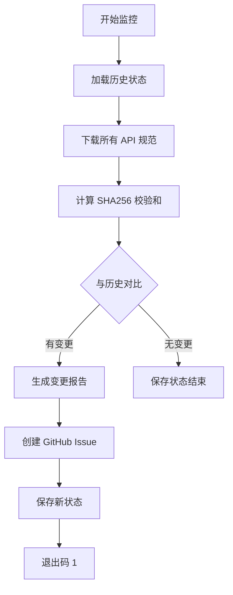

# Amazon Ads API Monitor

自动监控 Amazon Advertising API 的规范变更工具。

## 🎯 功能特性

- ✅ **全面覆盖**：监控所有 45 个官方 Amazon Ads API
- ✅ **自动检测**：检测 API 新增、删除、版本更新
- ✅ **SHA256 校验**：通过校验和精确检测规范文件变更
- ✅ **详细报告**：生成包含操作指南的变更报告
- ✅ **GitHub 集成**：自动创建 Issue 通知团队
- ✅ **定时运行**：每周自动检查 + 手动触发

## 📊 监控的 API 列表

### 核心广告产品 (4)
- Sponsored Products v3
- Sponsored Brands v4
- Sponsored Display v3
- Sponsored TV

### 核心账户管理 (4)
- Profiles v3
- Portfolios v2
- Advertising Accounts
- Manager Accounts

### 报告和分析 (5)
- Reporting v3
- Brand Metrics
- Insights
- Stores Analytics
- Marketing Mix Modeling

### DSP (5)
- DSP Audiences
- DSP Conversions
- DSP Measurement
- DSP Target KPI
- DSP Advertisers

### 受众和定向 (3)
- Audiences Discovery
- Persona Builder
- Locations

### 创意和素材 (4)
- Creative Assets
- Moderation
- Pre-Moderation
- Ad Library

### 产品和目录 (2)
- Product Metadata
- Product Eligibility

### 归因和测量 (2)
- Amazon Attribution
- Reach Forecasting

### 财务和预算 (2)
- Billing
- Account Budgets

### 数据管理 (4)
- Exports
- Marketing Stream
- Hashed Records
- Data Provider

### 其他 (10)
- Tactical Recommendations
- Change History
- Partner Opportunities
- Test Accounts
- Amazon Ads v1 (统一 API)
- Retail Ad Service
- Retail Ad Service Identity
- Posts (已弃用)
- Sponsored Products v2 (旧版本)
- Sponsored Brands v3 (旧版本)

**总计：45 个 API**

## 🚀 使用方法

### 本地运行

```bash
cd tools/api-monitor
go run main.go
```

### 通过 GitHub Actions 运行

1. **自动运行**：每周一 00:00 UTC 自动执行
2. **手动触发**：在 GitHub Actions 页面手动运行工作流

## 📋 监控流程



## 📄 输出文件

### 1. `monitor-state.json`
存储每个 API 的状态：
- API 名称
- URL
- SHA256 校验和
- 版本号
- 最后检查时间

示例：
```json
{
  "specs": [
    {
      "name": "Sponsored Products v3",
      "url": "https://advertising.amazon.com/API/docs/en-us/openapi/sponsored-products/openapi.json",
      "checksum": "a1b2c3d4e5f6...",
      "version": "3.0",
      "last_check": "2025-10-07T10:30:00Z"
    }
  ]
}
```

### 2. `latest-changes.md`
详细的变更报告，包含：
- 新增的 API
- 删除/弃用的 API
- 版本/规范变更的 API
- 操作指南
- 版本管理建议

## 🔔 变更检测

### 检测类型

1. **新增 API** 🆕
   - 之前监控列表中没有
   - 官方新发布的 API

2. **删除/弃用 API** 🗑️
   - 之前有，现在监控列表中移除
   - 官方弃用或下线的 API

3. **规范变更** 🔄
   - SHA256 校验和改变
   - 可能包含：
     - 版本号更新
     - 参数变更
     - 端点变更
     - 数据模型变更
     - 文档更新

### 变更示例

```
📢 API CHANGES DETECTED!
============================================================

🆕 New APIs:
  • New Feature API (v1.0)

🗑️ Deleted/Deprecated APIs:
  • Old Legacy API

🔄 Updated APIs:
  • Sponsored Products v3: 3.0 → 3.1
  • Reporting v3: 2.5 → 3.0
============================================================
```

## 🛠️ 配置

### 添加新的 API 到监控列表

编辑 `main.go` 中的 `apiSpecs` 数组：

```go
var apiSpecs = []struct {
    Name string
    URL  string
}{
    {"Your New API", "https://advertising.amazon.com/API/docs/en-us/openapi/your-api/openapi.json"},
    // ...
}
```

### 调整检查频率

编辑 `.github/workflows/api-monitor.yml`：

```yaml
on:
  schedule:
    - cron: '0 0 * * 1'  # 每周一 00:00 UTC
```

## 📈 监控统计

工具会输出监控统计信息：

```
🔍 Starting Amazon Ads API Monitor...
📊 Monitoring 45 APIs in total
📡 Checking Sponsored Products v3...
✅ No changes in Sponsored Products v3 (v3.0)
📡 Checking Sponsored Brands v4...
🔄 Change detected in Sponsored Brands v4!
   Old version: 4.0
   New version: 4.1
   ...
```

## 🔒 安全性

- ✅ 只读操作，不修改任何官方资源
- ✅ 使用 HTTPS 下载规范
- ✅ 30秒超时防止挂起
- ✅ 请求间隔 2 秒，避免频繁请求

## 🤝 与 GitHub Actions 集成

当检测到变更时，工作流会自动：

1. ✅ 创建 GitHub Issue
2. ✅ 标记为 `api-change` 和 `automated`
3. ✅ 附加详细的变更报告
4. ✅ 通知项目维护者

## 📝 维护指南

### 定期检查

1. 查看每周的监控报告
2. 审查检测到的变更
3. 评估变更影响（破坏性/兼容性）
4. 规划 SDK 更新

### 应对变更

1. **小变更（Patch）**
   - 文档更新
   - 小幅参数调整
   - 快速修复

2. **中等变更（Minor）**
   - 新增端点
   - 新增可选参数
   - 新功能

3. **重大变更（Major）**
   - 删除端点
   - 必填参数变更
   - 数据结构重构
   - 需要迁移指南

## 🐛 故障排查

### 下载失败

```
❌ Failed to download API: HTTP 404
```

**解决方案**：
- 检查 URL 是否正确
- 确认 API 是否已下线
- 检查网络连接

### 校验和一直变化

**原因**：
- 官方可能每次生成规范时添加时间戳
- 规范文件格式变化（空格、换行）

**解决方案**：
- 检查实际内容是否有意义变更
- 考虑使用规范化的 JSON 比较

## 📚 参考资料

- [Amazon Advertising API 官方文档](https://advertising.amazon.com/API/docs/en-us)
- [OpenAPI 规范](https://spec.openapis.org/oas/v3.0.0)
- [项目主仓库](https://github.com/vanling1111/amazon-ads-api-go-sdk)

---

**维护者**: Amazon Ads API Go SDK Team  
**许可证**: AGPL-3.0 + Commercial License

